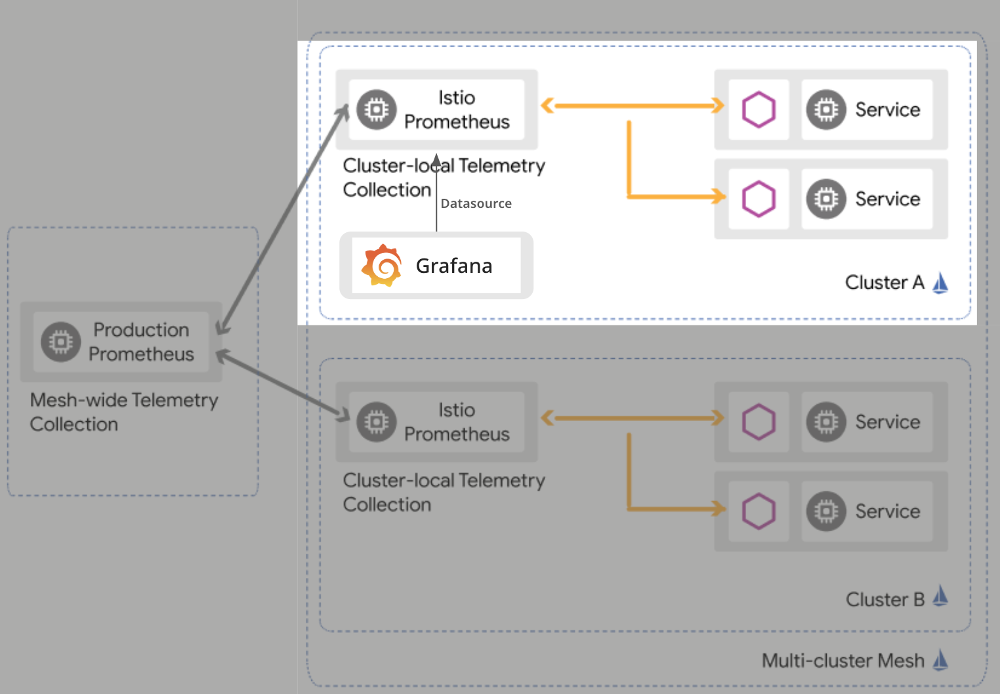

# HYU Graduation Project Kubernetes Cluster Setup Guide



`/k8s` 경로 내의 파일들은 위 Architecture에서 밝은 부분의 영역을 포함합니다.  
클러스터 설정의 최종 목표는 어두운 부분의 영역을 포함하여 멀티 클러스터 환경을 구성하는 것입니다.

## Prerequisites

클러스터 설정을 시작하기 이전에, 다음과 같은 Tool 설치가 필요합니다.

- [kubectl v1.2.40+](https://kubernetes.io/docs/tasks/tools/)
- [istioctl v1.17+](https://istio.io/latest/docs/setup/getting-started/#download)
- [calicoctl v3.26+](https://docs.tigera.io/calico/latest/operations/calicoctl/install)

## Setup Cluster

### 1. Setup nginx-ingress-controller on your cluster

다음과 같은 명령어를 실행하여 클러스터에 `nginx-ingress-controller`를 설치합니다.

```bash
kubectl apply -f https://raw.githubusercontent.com/kubernetes/ingress-nginx/controller-v1.10.0/deploy/static/provider/cloud/deploy.yaml
```

### 2. Install Istio with `istioctl`

`istioctl`를 이용하여 Istio를 클러스터에 설치합니다.

```bash
istioctl install --set profile=minimal -y
kubectl label namespace default istio-injection=enabled
```

#### Reference

- [Install with `istioctl`](https://istio.io/latest/docs/setup/install/istioctl/)

### 3. Install Prometheus

Istio에서 제공하는 Prometheus 설치 YAML 파일을 이용하여 Prometheus를 설치합니다.

```bash
kubectl apply -f https://raw.githubusercontent.com/istio/istio/release-1.20/samples/addons/prometheus.yaml
```

#### Reference

- [Istio - Prometheus](https://istio.io/latest/docs/ops/integrations/prometheus/#option-1-quick-start)

### 4. Install Grafana

Istio에서 제공하는 Grafana 설치 YAML 파일을 이용하여 Grafana를 설치합니다.

```bash
kubectl apply -f https://raw.githubusercontent.com/istio/istio/release-1.20/samples/addons/grafana.yaml
```

다음의 명령어를 이용하여 Grafana 대시보드 동작을 확인할 수 있습니다.

```bash
istioctl dashboard grafana
```

#### Reference

- [Istio - Grafana](https://istio.io/latest/docs/ops/integrations/grafana/#option-1-quick-start)

### 5. Apply Resources

Test에 사용할 Dummy Resource를 배포합니다.

```bash
kubectl apply -f deployment.yaml
kubectl apply -f service.yaml
kubectl apply -f ingress.yaml
```

## Clean Up

환경을 정리하기 위해서 다음의 명령어를 사용할 수 있습니다.

```bash
# Remove resources
kubectl delete -f ingress.yaml
kubectl delete -f service.yaml
kubectl delete -f deployment.yaml

# Remove Grafana
kubectl delete -f https://raw.githubusercontent.com/istio/istio/release-1.20/samples/addons/grafana.yaml

# Remove Prometheus
kubectl delete -f https://raw.githubusercontent.com/istio/istio/release-1.20/samples/addons/prometheus.yaml

# Remove Istio
istioctl uninstall --purge

# Disable Nginx Ingress Controller
minikube addons disable ingress

# Stop the cluster
minikube stop
```

## TODO

해당 클러스터 완성을 위한 Action Item은 다음과 같습니다.

- [ ] Minikube 클러스터를 VM 기반 클러스터로 Migration
- [ ] Dummy Application 고도화: 복잡한 Topology 구성
- [ ] 멀티 클러스터 구성
- [ ] 클러스터 Fedaration 환경 구성 (Karmada 등 이용)
- [ ] (도입 여부 판단 필요) HELM 차트 구성
